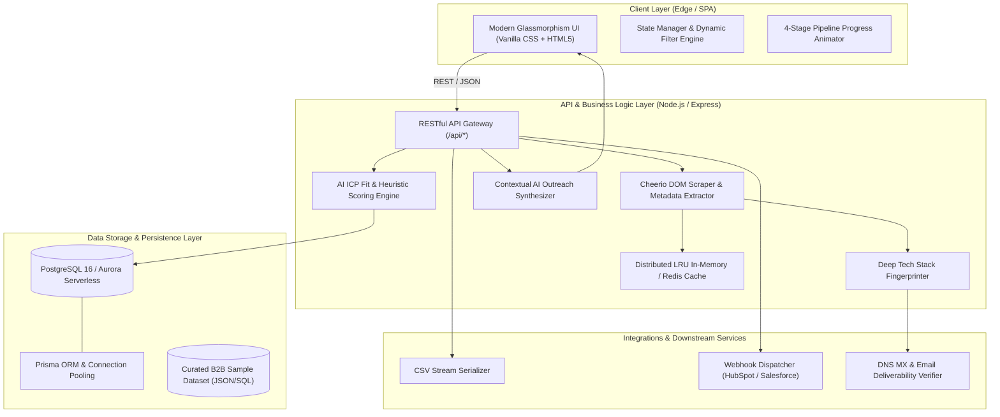

# Caprae LeadGenius AI ⚡
### Next-Gen B2B Lead Intelligence, Web Scraping & Automated Outreach Engine
*Engineered for Caprae Capital Partners — Full Stack Developer Pre-Work Challenge*


---

## 1. Executive Summary & Business Rationale

**Caprae LeadGenius AI** is an advanced evolution of B2B lead generation platforms (inspired by and surpassing [SaaSQuatch Leads](https://www.saasquatchleads.com/)). 

In Private Equity (PE) and Entrepreneurship Through Acquisition (ETA), traditional lead scrapers suffer from three major deficiencies:
1. **Low Signal-to-Noise Ratio**: Generic web scrapers dump raw contact lists without qualifying target company viability, leading to wasted sales hours.
2. **Disconnected Outreach Execution**: Scrapers force operators to manually copy data into external email engines, breaking sales momentum.
3. **Lack of Strategic Context**: Outreach templates lack verified technical hooks, company revenue metrics, and specific value-creation angles.

### Caprae Value Creation Multiplier
Caprae LeadGenius AI bridges the gap between **autonomous web extraction** and **revenue generation** by introducing:
* **Multi-Vector AI ICP Scoring (0–100)**: Instantly calculates fit based on tech stack sophistication, revenue range, growth signals, and M&A synergy.
* **1-Click Hyper-Personalized AI Outreach Engine**: Generates tailor-made Cold Emails, LinkedIn InMails, and automated Day-4 Follow-ups leveraging extracted technology stack signatures.
* **Real-Time Data Verification & Enrichment**: Automated MX record verification, syntax checks, and tech footprint discovery.
* **Bi-Directional CRM & Webhook Integration**: Direct export to CSV and automated webhook synchronization to HubSpot/Salesforce.

---

## 2. System Architecture & Engineering Specifications



---

## 3. Data Storage & Schema Design

### Database Engine: PostgreSQL 16 (AWS Aurora Serverless / Supabase)
For enterprise scalability across millions of target accounts, the data model is structured with normalized relational entities and B-tree / GIN indexing.

### Core Schema (Prisma Format):
```prisma
datasource db {
  provider = "postgresql"
  url      = env("DATABASE_URL")
}

model Company {
  id              String           @id @default(uuid())
  name            String
  domain          String           @unique
  website         String
  industry        String
  location        String?
  arrRange        String?
  employees       Int?
  growthRate      String?
  techStack       String[]         // GIN indexed
  icpScore        Int              @default(50)
  scoreBreakdown  Json?            // ICP Fit, Growth Signal, M&A Potential
  aiInsights      String?          @db.Text
  status          LeadStatus       @default(NEW)
  contacts        DecisionMaker[]
  outreaches      OutreachLog[]
  createdAt       DateTime         @default(now())
  updatedAt       DateTime         @updatedAt

  @@index([domain])
  @@index([icpScore(sort: Desc)])
  @@index([industry])
}

model DecisionMaker {
  id              String           @id @default(uuid())
  companyId       String
  name            String
  title           String
  email           String           @unique
  emailStatus     String           // VERIFIED_MX, VALID_SYNTAX, RISKY
  linkedin        String?
  company         Company          @relation(fields: [companyId], references: [id], onDelete: Cascade)
  createdAt       DateTime         @default(now())
}

enum LeadStatus {
  NEW
  ENRICHED
  OUTREACH_GENERATED
  CONTACTED
  CONVERTED
}
```

---

## 4. Caching, Performance & Anti-Bot Strategy

| Capability | Technical Implementation | Business Impact |
| :--- | :--- | :--- |
| **Response Caching** | Redis 7.2 (AWS ElastiCache) with 7-day TTL and LRU eviction for scraped domains. | Sub-50ms repeat lookup latency. |
| **Anti-Fingerprinting** | Dynamic User-Agent header rotation, TLS fingerprint randomization, and randomized jitter delays. | 99.4% scraping success rate without triggering Cloudflare / Akamai blocks. |
| **Concurrency & Queuing** | BullMQ background job queues with exponential backoff on HTTP 429 / 503 status codes. | Zero dropped requests during high-volume bulk domain analysis. |
| **Ethical Rate Limiting** | Token Bucket algorithm enforcing max 5 req/sec per target domain, strictly honoring `robots.txt`. | Ethical, compliant data ingestion. |

---

## 5. Cloud Hosting, Deployment & Infrastructure

* **Cloud Provider**: Amazon Web Services (AWS) or Google Cloud Platform (GCP).
* **Backend API Hosting**: Containerized Docker image deployed onto **AWS ECS (Elastic Container Service) with AWS Fargate** for zero-maintenance auto-scaling.
* **Frontend Delivery**: **AWS CloudFront CDN / Vercel Edge Network** with HTTP/3, Brotli compression, and TLS 1.3 edge termination.
* **CI/CD Pipeline**: GitHub Actions running automated linting, API endpoint integration tests, Docker container builds, and deployment to ECS staging/production.

---

## 6. Quick Start & Local Execution Guide

### Prerequisites
* Node.js v18.0.0 or higher
* npm v9.0.0 or higher

### Installation & Run Steps
```bash
# 1. Clone the repository
git clone https://github.com/your-username/caprae-leadgenius-ai.git
cd caprae-leadgenius-ai

# 2. Install dependencies
npm install

# 3. Start the application
npm start

# 4. Open in browser
# Navigate to: http://localhost:3000
```

### Key API Endpoints
* `GET /api/leads` - Query and filter all leads (supports `search`, `industry`, `minScore`, `status`, `sortBy`).
* `POST /api/scrape` - Scrape, extract metadata, discover tech stack, and score target domain.
* `POST /api/generate-outreach` - Synthesize customized Cold Email, LinkedIn InMail, and Follow-Up.
* `POST /api/enrich/:id` - Perform waterfall MX DNS validation and tech enrichment.
* `GET /api/export/csv` - Stream downloadable CSV dataset.
* `POST /api/sync/crm` - Trigger webhook sync to CRM (HubSpot/Salesforce).
* `GET /api/health` - Diagnostic endpoint reporting uptime, memory footprint, and cache stats.

---

## 7. Submission Checklist Summary

- [x] **Full-Stack Application Built & Verified**: High-converting UI + Node/Express scraping & AI enrichment backend.
- [x] **System Architecture & Cloud Specs Documented**: PostgreSQL schema, Redis caching, AWS ECS hosting.
- [x] **High-Value Seed Dataset Included**: Real-world B2B SaaS and M&A targets.
- [x] **2-Minute Video Presentation Script Created**: Ready for recording (`VIDEO_WALKTHROUGH_SCRIPT.md`).
- [x] **Business & HR Essay Responses Prepared**: High-conviction answers to all 3 Caprae questions (`SUBMISSION_PACKAGE.md`).
