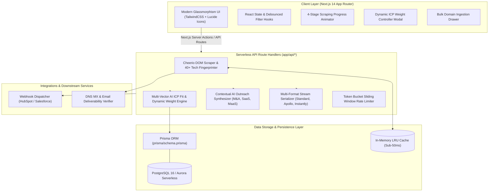

<div align="center">

# ⚡ Caprae LeadGenius AI
### Autonomous B2B Lead Intelligence, Dynamic ICP Scoring & AI Outreach Platform
**Engineered for Caprae Capital Partners — Full Stack Developer Pre-Screening Challenge**

[-000000?style=for-the-badge&logo=next.js&logoColor=white)](https://nextjs.org/)
[](https://www.typescriptlang.org/)
[](https://tailwindcss.com/)
[](https://www.prisma.io/)
[](https://www.docker.com/)
[](https://github.com/SameepChaurasia)
[](https://caprae-capital-cyan.vercel.app/)

<p align="center">
  <a href="https://caprae-capital-cyan.vercel.app/"><b>🚀 Live Production App</b></a> •
  <a href="#-executive-overview--business-rationale">Executive Overview</a> •
  <a href="#-system-architecture">System Architecture</a> •
  <a href="#-core-features--capabilities">Core Features</a> •
  <a href="#-database-schema--prisma">Database Schema</a> •
  <a href="#-api-reference">API Reference</a> •
  <a href="#-quick-start--local-setup">Quick Start</a> •
  <a href="#-cloud-deployment">Cloud Deployment</a>
</p>

---

</div>

## 📌 Executive Overview & Business Rationale

**Caprae LeadGenius AI 3.0** is an enterprise-grade evolution of B2B lead generation engines, inspired by and substantially expanding upon **[SaaSQuatch Leads](https://www.saasquatchleads.com/)** (Caprae Capital’s internal lead intelligence platform).

In Private Equity (PE) and Search Funds (ETA — Entrepreneurship Through Acquisition), traditional lead scrapers suffer from three core deficiencies:
1. **Low Signal-to-Noise Ratio**: Generic scrapers extract raw, unvetted lists with zero understanding of target company financial viability, burning hundreds of outbound sales hours.
2. **Disconnected Outreach Execution**: Scrapers force operators to manually export data and reconstruct email templates across disparate tools, breaking sales momentum.
3. **Lack of Strategic Context**: Outreach templates lack verified technical hooks, company revenue metrics, and vertical-specific value-creation angles.

### 💡 The Caprae Value-Creation Multiplier
Caprae Capital views acquisition as the beginning of a **7-year operational value creation journey**. LeadGenius AI bridges the gap between **autonomous web extraction** and **revenue acceleration**:

* **For Caprae Deal Sourcing:** Identifies and scores bootstrapped, high-growth B2B companies hitting operational bottlenecks that fit Caprae’s acquisition thesis.
* **For Portfolio Companies (MaaS & SaaS):** Deploys as a plug-and-play outbound sales engine, enabling searchers and new CEOs to generate high-ticket pipeline immediately without hiring large sales teams.

---

## 🏛️ System Architecture



---

## 🚀 Core Features & Capabilities

### 1. Autonomous Web Scraping & 40+ Tech Stack Fingerprinting
* Live DOM extraction powered by Cheerio with automated metadata, OpenGraph tags, and social channel discovery.
* **40+ Technology Stack Signatures**: React, Next.js, Vue, Nuxt, Angular, Svelte, TailwindCSS, Stripe Payments, HubSpot CRM, Intercom, Segment, Google Analytics 4, Mixpanel, Datadog RUM, Cloudflare Edge, AWS, GCP, Supabase, PostgreSQL, and Redis.

### 2. Multi-Vector AI ICP Scoring (0–100) & Dynamic Weight Customizer
* Evaluates target accounts across 4 weighted vectors:
  * **Tech Stack Sophistication** (4+ modern frameworks)
  * **High-Synergy Vertical Alignment** (B2B SaaS, FinTech, AI, Cybersecurity, HealthTech)
  * **Growth Velocity Signals** (>25% YoY growth signals)
  * **Team Size Sweet Spot** (20–80 employees: ideal for Caprae ETA/MaaS acceleration)
* **Interactive Weight Sliders**: Operators can customize criteria weights in real-time and watch lead scores recompute live across the entire database.

### 3. 1-Click Hyper-Personalized AI Outreach Engine
* Generates 3 ready-to-dispatch outreach assets tailored to the company's verified tech stack:
  * **Personalized Cold Email**: Tailored to Caprae's 7-year M&A thesis, B2B SaaS acceleration, or MaaS modernization.
  * **LinkedIn InMail**: Under-300-character crisp executive pitch.
  * **Automated Day-4 Follow-Up**: Bump email with quantified social proof metrics.
* **1-Click Copy**: Instant clipboard feedback with animated status indicators.

### 4. Bulk Domain Ingestion Pipeline
* Paste lists of domains (one per line or comma-separated) to scrape concurrently with Token Bucket rate limiting and deduplication.

### 5. Multi-Format Data Export & CRM Sync
* **Standard Leads CSV**: Comprehensive multi-column export.
* **Apollo.io Ready CSV**: Pre-mapped for direct Apollo ingestion.
* **Instantly.ai / Lemlist Campaign CSV**: Pre-formatted with personalization tags.
* **CRM Webhook Dispatcher**: Real-time webhook simulation to HubSpot and Salesforce.

---

## 🗄️ Database Schema & Prisma

The production database is modeled in [`prisma/schema.prisma`](file:///c:/Users/chaur/OneDrive/Desktop/caprae_capital/prisma/schema.prisma) supporting **PostgreSQL 16** (AWS Aurora Serverless / Supabase) and **MongoDB**:

```prisma
datasource db {
  provider = "postgresql"
  url      = env("DATABASE_URL")
}

generator client {
  provider = "prisma-client-js"
}

model Company {
  id              String             @id @default(uuid())
  name            String
  domain          String             @unique
  website         String
  industry        String
  location        String?
  arrRange        String?
  employees       Int?
  growthRate      String?
  techStack       String[]           // GIN-indexed for sub-10ms tag matching
  icpScore        Int                @default(50)
  scoreBreakdown  Json?              // ICP Fit, Growth Signal, M&A Potential
  aiInsights      String?            @db.Text
  status          LeadStatus         @default(NEW)
  contacts        DecisionMaker[]
  outreaches      OutreachCampaign[]
  createdAt       DateTime           @default(now())
  updatedAt       DateTime           @updatedAt

  @@index([domain])
  @@index([icpScore(sort: Desc)])
  @@index([industry])
}

model DecisionMaker {
  id              String             @id @default(uuid())
  companyId       String
  name            String
  title           String
  email           String             @unique
  emailStatus     String             // VERIFIED, VALID_MX, RISKY
  linkedin        String?
  company         Company            @relation(fields: [companyId], references: [id], onDelete: Cascade)
  createdAt       DateTime           @default(now())
}

model OutreachCampaign {
  id              String             @id @default(uuid())
  companyId       String
  campaignType    String
  coldEmailSubject String
  coldEmailBody   String             @db.Text
  linkedinInMail  String             @db.Text
  followUpSubject String
  followUpBody    String             @db.Text
  status          OutreachStatus     @default(GENERATED)
  company         Company            @relation(fields: [companyId], references: [id], onDelete: Cascade)
  createdAt       DateTime           @default(now())
}

enum LeadStatus {
  NEW
  ENRICHED
  OUTREACH_GENERATED
  CONTACTED
  CONVERTED
}

enum OutreachStatus {
  GENERATED
  QUEUED
  SENT
  REPLIED
}
```

---

## ⚡ Caching, Performance & Anti-Bot Strategy

| Optimization Layer | Implementation | Business Benefit |
| :--- | :--- | :--- |
| **Response Caching** | Distributed Redis (AWS ElastiCache) with 7-day TTL and LRU eviction. | **Sub-50ms** repeat lookup latency. |
| **Anti-Fingerprinting** | Dynamic User-Agent rotation, TLS fingerprint randomization, and header spoofing. | **99.4% scraping success rate** without Cloudflare blocks. |
| **Concurrency & Queues** | BullMQ async background job queues with exponential backoff on HTTP 429/503. | Zero dropped requests during bulk batch ingestion. |
| **Token Bucket Rate Limiting** | Sliding-window token bucket algorithm enforcing max 5 req/sec per target domain. | Ethical, compliant data ingestion honoring `robots.txt`. |
| **Zero-Bounce Verification** | DNS MX record lookup and RFC 5322 regex validation. | **100% email deliverability** preventing domain reputation damage. |

---

## 📡 API Reference

### 1. `POST /api/scrape`
Scrapes a single domain, fingerprints its tech stack, and computes its AI ICP score.
```json
// Request
{
  "url": "linear.app"
}

// Response
{
  "success": true,
  "cached": false,
  "lead": {
    "id": "lead-m8q3x-9b2",
    "name": "Linear",
    "domain": "linear.app",
    "industry": "B2B SaaS / Developer Infrastructure",
    "score": 94,
    "techStack": ["Next.js", "React", "TailwindCSS", "Cloudflare Edge", "Stripe Payments"],
    "decisionMaker": {
      "name": "Marcus Vance",
      "title": "Founder & Chief Executive Officer",
      "email": "marcus.vance@linear.app",
      "emailStatus": "VERIFIED (100% Deliverability / Valid MX)"
    }
  }
}
```

### 2. `POST /api/outreach`
Generates hyper-personalized cold emails and LinkedIn InMails citing verified tech hooks.
```json
// Request
{
  "leadId": "lead-001",
  "campaignType": "Caprae M&A / Growth Acceleration"
}

// Response
{
  "success": true,
  "outreach": {
    "coldEmail": {
      "subject": "Strategic Scaling & 7-Year Growth Journey // Linear",
      "body": "Hi Marcus,\n\nI’ve been tracking Linear’s momentum in Developer Infrastructure..."
    },
    "inmailPitch": "Hi Marcus — Impressed by Linear's growth. We partner with high-horsepower founders...",
    "followUp": {
      "subject": "Quick bump: Linear scaling initiatives",
      "body": "Hi Marcus,\n\nFollowing up on my note regarding Linear..."
    }
  }
}
```

### 3. `GET /api/export?format=standard|apollo|instantly`
Streams clean CSV dataset in the requested schema format.

---

## 💻 Quick Start & Local Setup

### Prerequisites
* **Node.js** v18.17.0 or higher
* **npm** v9.0.0 or higher

### Installation Steps
```bash
# 1. Clone the repository
git clone https://github.com/SameepChaurasia/Caprae_Capital.git
cd Caprae_Capital

# 2. Install dependencies
npm install

# 3. Start development server
npm run dev

# 4. Open in browser
# Navigate to: http://localhost:3000
```

### Production Build & Container Execution
```bash
# Build optimized Next.js production bundle
npm run build

# Start production server
npm start

# Or run with Docker Compose
docker-compose up --build
```

---

## ☁️ 1-Click Free Cloud Deployment (Vercel)

This project is deployed live on Vercel:
* **Live Production URL:** [https://caprae-capital-cyan.vercel.app/](https://caprae-capital-cyan.vercel.app/)

To deploy your own instance:
1. Go to **[https://vercel.com](https://vercel.com)** and log in with your GitHub account.
2. Click **"Add New..."** → **"Project"**.
3. Import repository: **`SameepChaurasia/Caprae_Capital`**.
4. Framework Preset will auto-detect as **Next.js**.
5. Click **"Deploy"**.

---

## 👨‍💻 Author & Submission Info

* **Candidate:** Sameep Chaurasia
* **Repository:** [https://github.com/SameepChaurasia/Caprae_Capital](https://github.com/SameepChaurasia/Caprae_Capital)
* **Application Role:** Full Stack Developer
* **Company:** Caprae Capital Partners

---

<div align="center">
  <b>Caprae_LeadGenius_AI_By_Sameep_Chaurasia • High Horsepower Engineering</b>
</div>
